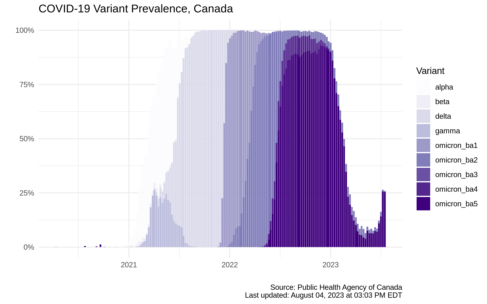

# COVID-19 Canada Variant Data

The data in this repository is published by [Global News](https://globalnews.ca) and comes from the weekly variant breakdown published by the [Public Health Agency of Canada](https://health-infobase.canada.ca/covid-19/epidemiological-summary-covid-19-cases.html#VOC). The data is updated once per week on Friday afternoon. [**Download the data in JSON format here.**](https://raw.githubusercontent.com/ShawONEX/global-news-interactive-data/main/covid-variants/data/covid-19-variants-canada.json)

The data estimates variant prevalence as a percentage of overall cases, based on virus samples sequenced in laboratories across Canada. Because sequencing can take several weeks, the most recent estimates are delayed and may change as new samples are added.

This repository works by downloading PHAC's detailed [variant estimate](https://health-infobase.canada.ca/src/data/covidLive/covid19-epiSummary-variants.csv) dataset and simplifying it to include only prevalence estimates for each designated variant of concern as well as a single estimate for all variants of interest. The prevalence of other variants is summarized in an "other" category. Those estimates are then joined with weekly [sample size](https://health-infobase.canada.ca/src/data/covidLive/covid19-epiSummary-variants-sampleSize.csv) data.

An interactive visualization of the data can be seen in [this article](https://globalnews.ca/news/8404373/canada-travel-restrictions-south-africa-covid-19-variant/).

## Changelog
- 2022-06-28: Include all Omicron subvariants
- 2022-04-15: Add Other Omicron category
- 2022-03-22: Separate Omicron BA.1 and BA.2 subvariants
- 2022-02-08: Include data from March 2020 onward 
- 2022-02-02: Initial publication
